# Домашнее задание к занятию «ELK» - Илларионов Дмитрий

### Задание 1. Elasticsearch 

Установите и запустите Elasticsearch, после чего поменяйте параметр cluster_name на случайный. 

*Приведите скриншот команды 'curl -X GET 'localhost:9200/_cluster/health?pretty', сделанной на сервере с установленным Elasticsearch. Где будет виден нестандартный cluster_name*.

#### Решение

Создал ВМ через терраформ -см. код.

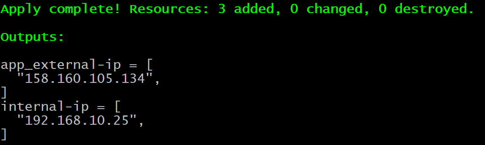

Подготовил конфиг эластика:

```
cluster.name: "elk-dmil"
network.host: 0.0.0.0 # Для корректной работы внутри контейнера

xpack.security.enabled: true # Для поддержки функционала, обеспечивающего безопасность кластера
xpack.license.self_generated.type: basic # Типа лицензии "basic" для наших нужд хватит с головой
```

Запустил эластик в докере:
```
services:
  elasticsearch:
    image: elasticsearch:7.16.1
    volumes:
      - ./configs/elasticsearch/config.yml:/usr/share/elasticsearch/config/elasticsearch.yml:ro
      # - ./docker_volumes/elasticsearch/data:/usr/share/elasticsearch/data
    environment:
      ES_JAVA_OPTS: "-Xmx512m -Xms512m"
      ELASTIC_USERNAME: "elastic"
      ELASTIC_PASSWORD: "test"
      discovery.type: single-node
    networks:
      - elk
    ports:
      - "9200:9200"
      - "9300:9300"
```

Зашел через браузер - авторизовался:
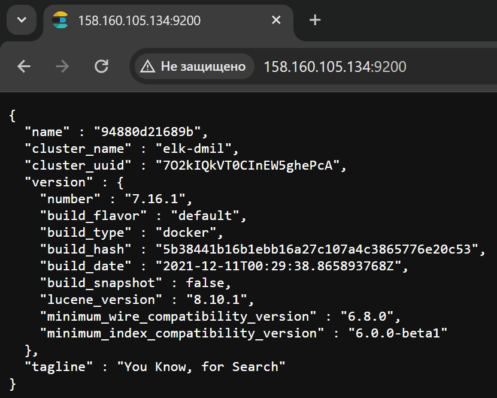

И еще вариант через curl:

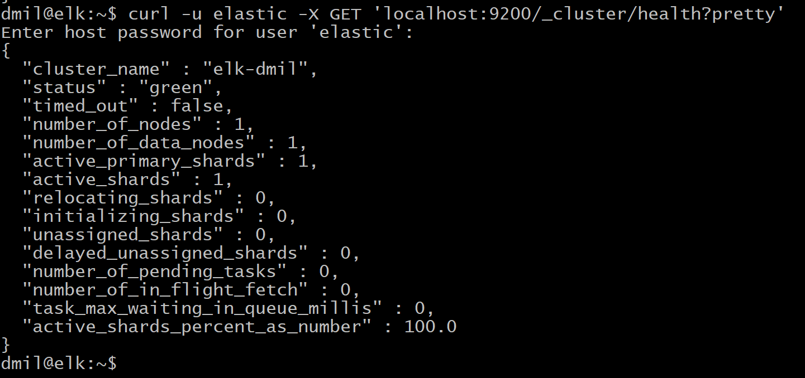

---

### Задание 2. Kibana

Установите и запустите Kibana.

*Приведите скриншот интерфейса Kibana на странице http://<ip вашего сервера>:5601/app/dev_tools#/console, где будет выполнен запрос GET /_cluster/health?pretty*.


#### Решение

Добавил в докер-копосе файл сервис:

```
  kibana:
    image: kibana:7.16.1
    depends_on:
      - elasticsearch
    volumes:
      - ./configs/kibana/config.yml:/usr/share/kibana/config/kibana.yml:ro
    networks:
      - elk
    ports:
      - "5601:5601"
```      
---

Обновил докер-компосе:

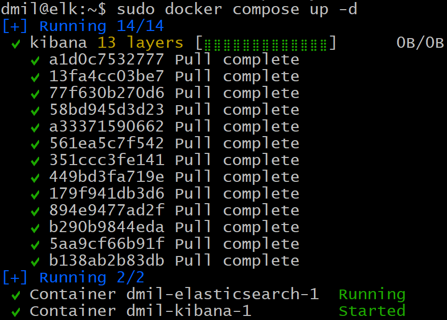

Зашел по ссылке и авторизовался:

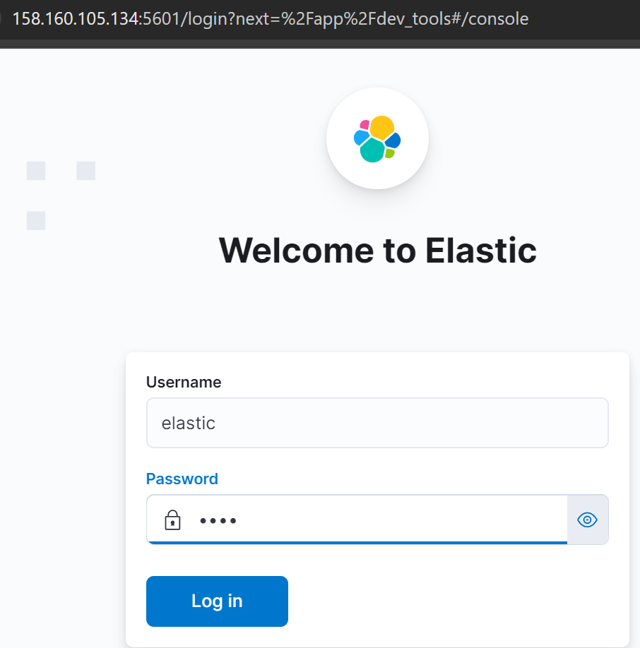

После авторизации:
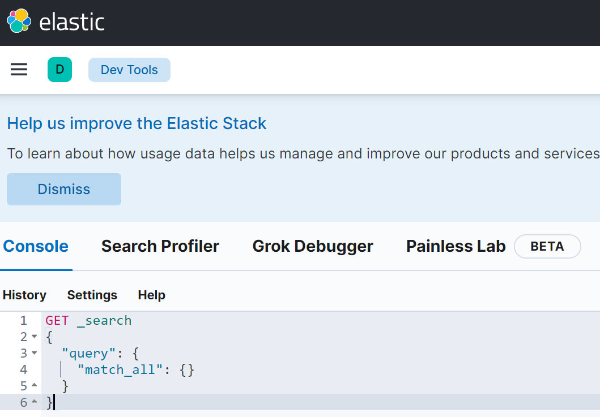

Выполняю свой запрос:

```
GET /_cluster/health?pretty
```
Результат:
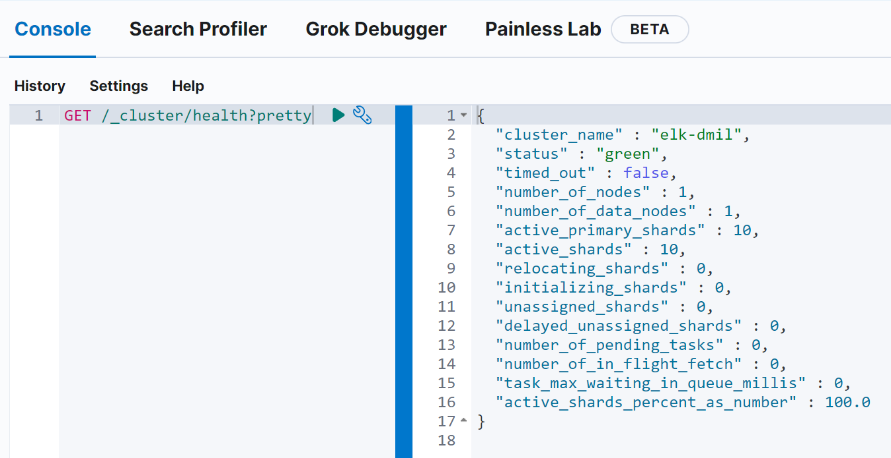


---

### Задание 3. Logstash

Установите и запустите Logstash и Nginx. С помощью Logstash отправьте access-лог Nginx в Elasticsearch. 

*Приведите скриншот интерфейса Kibana, на котором видны логи Nginx.*

#### Решение

добавил конфиг в docker-compose:

```
  logstash:
    image: logstash:7.16.2
    volumes:
      - ./configs/logstash/config.yml:/usr/share/logstash/config/logstash.yml:ro
      - ./configs/logstash/pipelines.yml:/usr/share/logstash/config/pipelines.yml:ro
      - ./configs/logstash/pipelines:/usr/share/logstash/config/pipelines:ro
      - /var/log/nginx/access.log:/usr/share/logstash/access.log:ro
    environment:
      LS_JAVA_OPTS: "-Xmx512m -Xms512m"
    ports:
      - "5044:5044"
      - "5001:5000"
      - "9600:9600"
    networks:
      - elk
    depends_on:
      - elasticsearch
```

Конфиги logstash

```
- pipeline.id: service_stamped_json_logs
  pipeline.workers: 1
  pipeline.batch.size: 1
  path.config: "/usr/share/logstash/config/pipelines/service_stamped_json_logs.conf"
```
и /usr/share/logstash/config/pipelines/service_stamped_json_logs.conf :

```
input {
  file {
    path => "/usr/share/logstash/access.log"
    start_position => "beginning"
  }
}

filter {
    grok {
        match => { "message" => "%{IPORHOST:remote_ip} - %{DATA:user} \[%{HTTPDATE:access_time}\] \"%{WORD:http_method} %{DATA:url} HTTP/%{NUMBER:http_version}\" %{NUMBER:response_code} %{NUMBER:body_sent_bytes} \"%{DATA:referrer}\" \"%{DATA:agent}\"" }
    }
    mutate {
        remove_field => [ "host" ]
    }
}


output {
  # Отображаем лог в stdout (поиграйтесь и удалите данную строку)
  stdout {}
  # Пушим лог в elasticsearch, индекс будет создан автоматически по названию сервиса и текущей дате
  elasticsearch {
    hosts => "elasticsearch:9200"
    index => "logs_nginx_test3"
    user => "elastic"
    password => "test"
  }
}

```

Запустил docker-compose

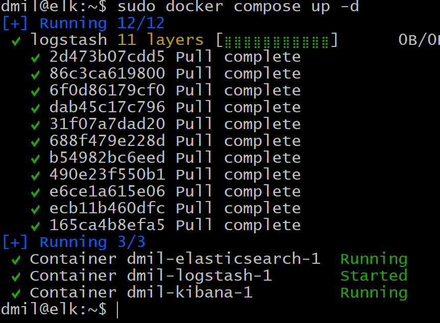

Или рестартовал контейнер (разные тесты пробовал).

"Дренул" NGINX:

```
curl localhost
```

Логи в кибане:

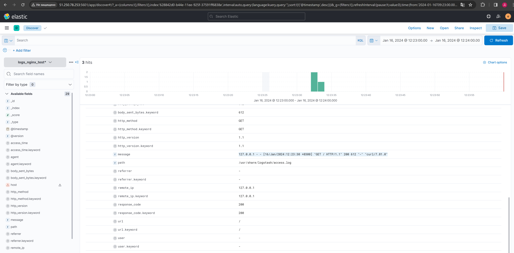

---

### Задание 4. Filebeat. 

Установите и запустите Filebeat. Переключите поставку логов Nginx с Logstash на Filebeat. 

*Приведите скриншот интерфейса Kibana, на котором видны логи Nginx, которые были отправлены через Filebeat.*

#### Результат

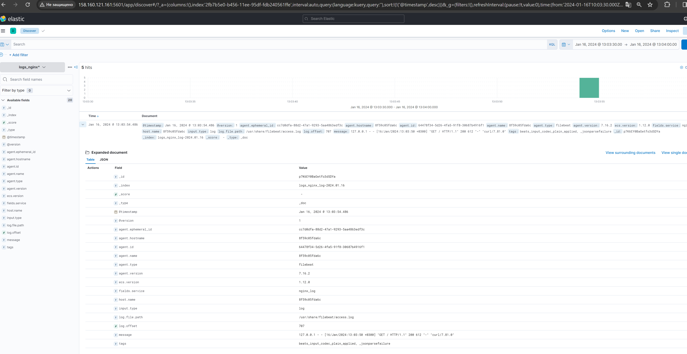


## Дополнительные задания (со звёздочкой*)
Эти задания дополнительные, то есть не обязательные к выполнению, и никак не повлияют на получение вами зачёта по этому домашнему заданию. Вы можете их выполнить, если хотите глубже шире разобраться в материале.

### Задание 5*. Доставка данных 

Настройте поставку лога в Elasticsearch через Logstash и Filebeat любого другого сервиса , но не Nginx. 
Для этого лог должен писаться на файловую систему, Logstash должен корректно его распарсить и разложить на поля. 

*Приведите скриншот интерфейса Kibana, на котором будет виден этот лог и напишите лог какого приложения отправляется.*

#### Решение

Еще дополнительно настроил- собирать логи Redis

лог редиса:

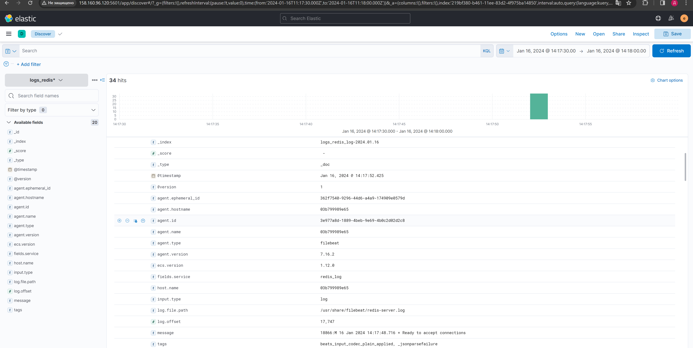

Весь код с подходом инфраструктура как код - см. в репозитории в папке trr (терраформ).